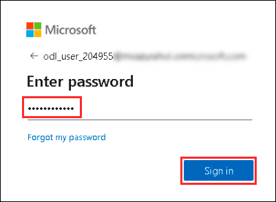
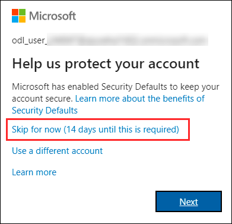

# Getting Started with Lab

1. Once the environment is provisioned, a virtual machine (LabVM) and lab guide will get loaded in your browser. Use this virtual machine throughout the workshop to perform the the lab.

1. To get the lab environment details, you can select **Environment Details (1)** tab. Additionally, the credentials will also be emailed to your email address provided at the time of registration. You can also open the Lab Guide on separate and full window by selecting the **Split Window (2)** from lower right corner. 

   You can also hit **Collapse (3)** at the bottom of the instructions pane to free up more screen real estate.

   
 
1. You can Start/Stop the lab resources (Virtual Machines) by navigating to the **Resources tab (1)** on top of the lab guide and use the **Actions** provided against resources. They are - **Start (2), Restart (3) and Stop (4)**.

   

## Login to Azure Portal
1. In the LabVM, click on Azure portal shortcut of Microsoft Edge browser which is created on desktop.

   
   
1. On **Sign in to Microsoft Azure** tab you will see login screen, in that enter following email/username and then click on **Next**. 
   * Email/Username: <inject key="AzureAdUserEmail"></inject>
   
     
     
1. Now enter the following password and click on **Sign in**.
   * Password: <inject key="AzureAdUserPassword"></inject>
   
     
     
   >**Note:** If you are presented with **Help us protect your account** dialog box, then select **Skip for now** option.

       
    
  
1. If you see the pop-up **Stay Signed in?**, click No

1. If you see the pop-up **You have free Azure Advisor recommendations!**, close the window to continue the lab.

1. If a **Welcome to Microsoft Azure** popup window appears, click **Maybe Later** to skip the tour.
   
1. Now, click on the **Next** button from lower right corner to move on next page.

