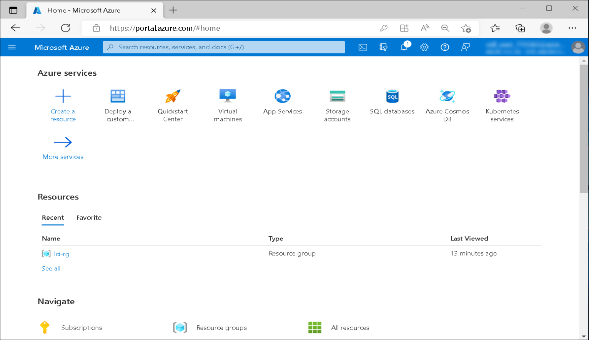
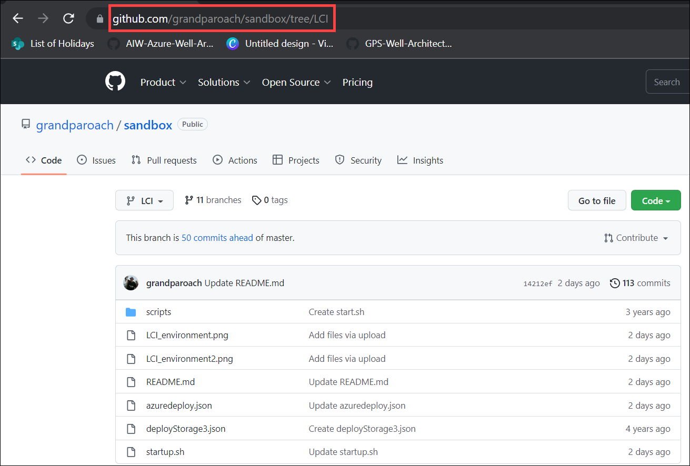
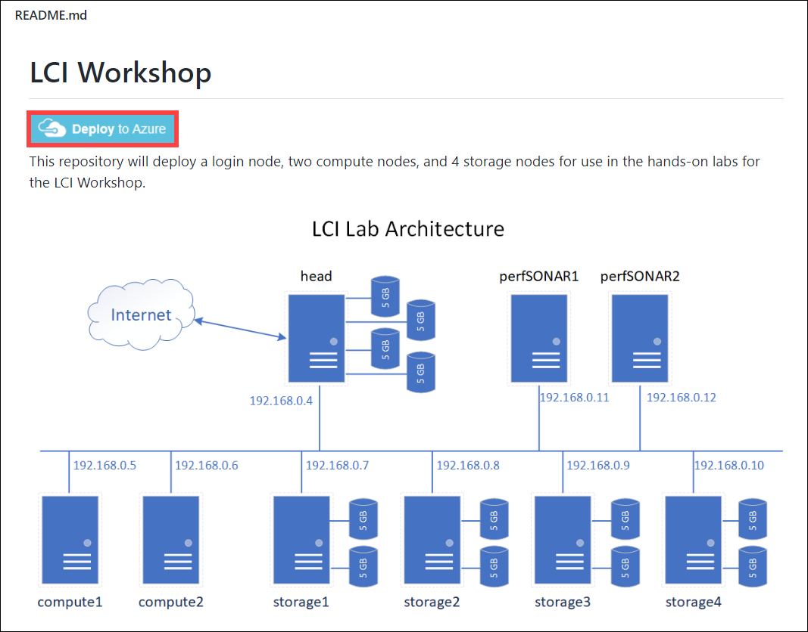
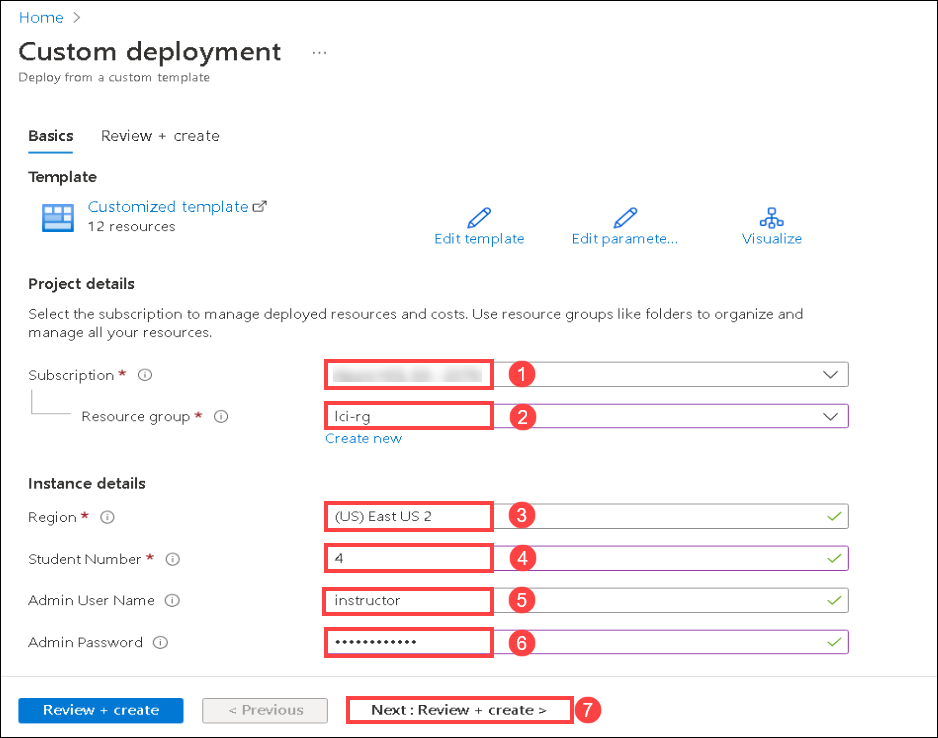
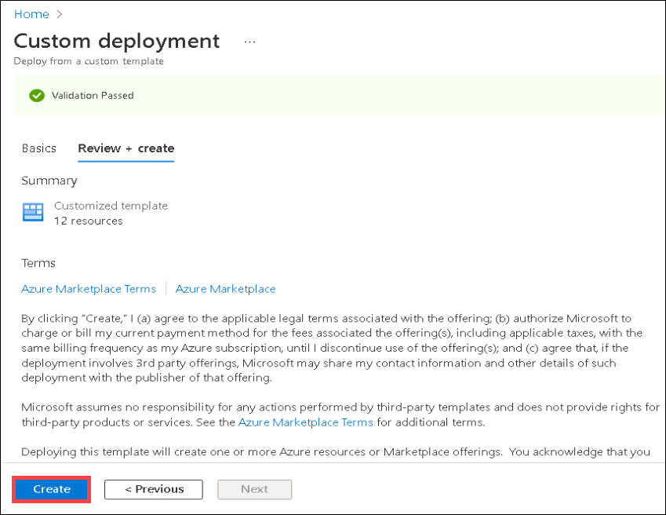
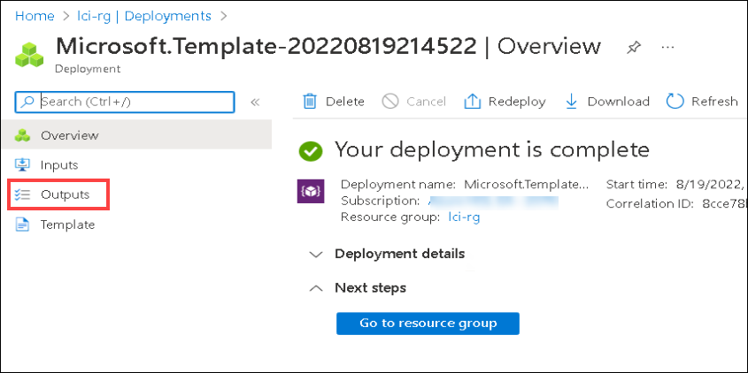
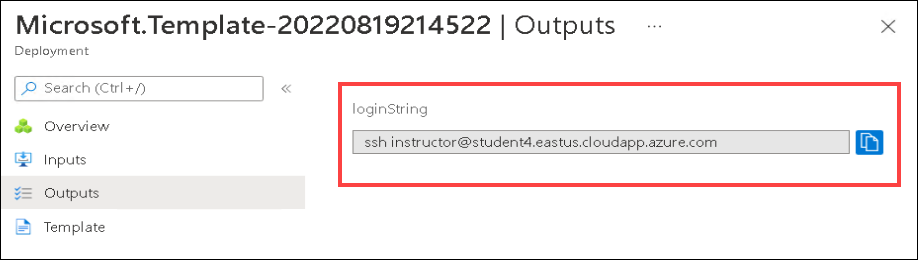
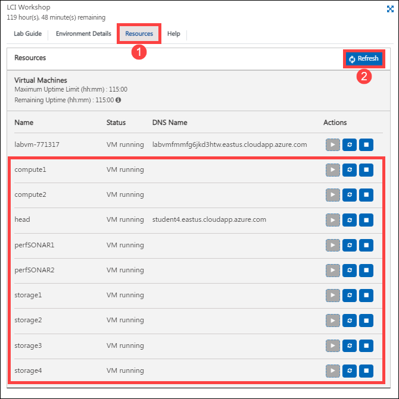
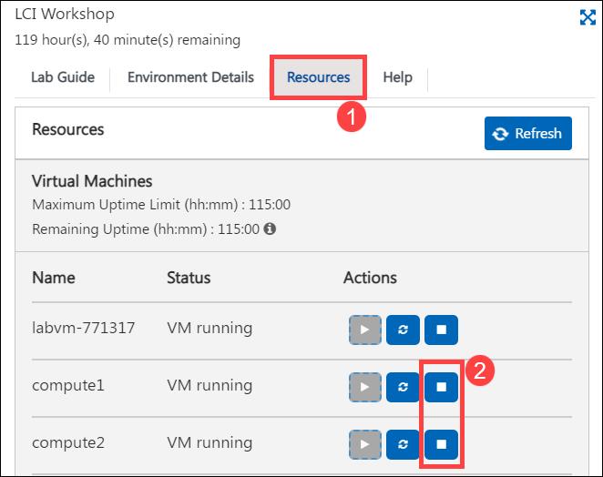

# Lab Instructions

1. You are at the portal.azure.com main window. 

    

2. Now open another tab in your browser and go to ``` https://github.com/grandparoach/sandbox/tree/LCI ```

    

3. Scroll down until you see the **Deploy to Azure** button and then click on it.

    

4. Fill in the fields as given below:

  - **Subscription:** Leave on default **(1)**
  - **Resource group:** Drop down the dialog box and select **lci-rg (2)**
  - **Region:** Leave on default **(3)**
  - **Student Number:** Fill in your student number **(4)**
  - **Admin User Name:** Leave it as **instructor (5)**
  - **Admin Password:** Create any password that you will remember that meets the criterion **(6)**
  - Click on **Review and Create (7)**.

    

5. Once the validation passes, click on **Create**.

    

6. It should take about 10 minutes to provision all the machines. 

7. After the deployment gets succeeded, click on **Outputs** menu option to reveal the login string.

    

8. It will have the login command for your head node, (with your student number in place of the #): ssh instructor@student#.eastus.cloudapp.azure.com

    

9. Copy that string to the clipboard and use your favorite terminal to ssh to the head node.

10. You can view status of all the virtual machines from **Resources (1)** tab. Click on **Refresh (2)** and it will list down all the Virtual machines deployed by you in the previous steps. 

    

11. At last, when you are done for the day, go to **Resources (1)** tab and **deallocate (2)** all of the Virtual Machines except the labvm.

> **Note:** **DO NOT** stop the **LabVM** as it is the host virtual machine, in which you are performing the lab.

   


